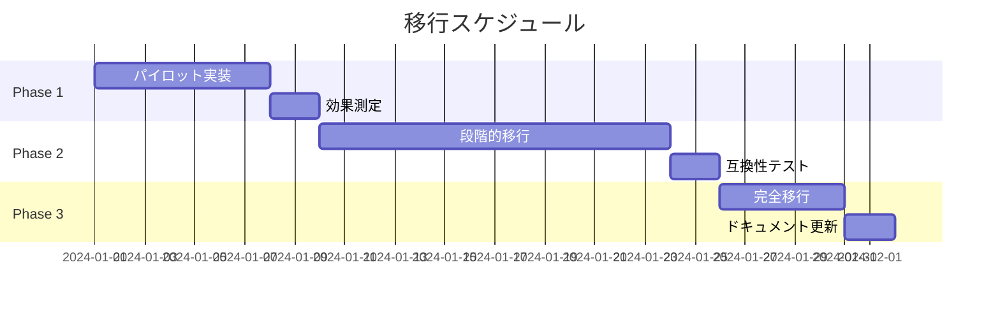

# サブエージェント統合移行計画

## 📅 移行ロードマップ

### 全体スケジュール（4週間）



## 🚀 Phase 1: パイロット実装（第1週）

### 対象コマンド選定

#### 優先度1（即座に実装）
| コマンド | 選定理由 | 複雑度 | 影響度 |
|---------|---------|--------|--------|
| 00-create-vision | 初期フェーズで重要 | 中 | 高 |
| 04-domain-modeling | 中核的な設計タスク | 高 | 高 |
| 05-create-tests | TDDの要となるコマンド | 中 | 高 |

### 実装手順

#### Day 1-2: 00-create-vision の移行
```bash
# 1. 新バージョン作成
cp 00-create-vision.md 00-create-vision-v2.md

# 2. 専門家プロンプト統合
# - サブエージェントからプロンプト抽出
# - カスタムコマンドへ統合

# 3. コンテキスト管理簡素化
# - 必須JSON: project-state.json のみ
# - オプション: execution-history.jsonl（最新5件）
```

#### Day 3-4: 04-domain-modeling の移行
```bash
# 同様のプロセスで実装
# 特に重要: DDD専門知識の詳細な組み込み
```

#### Day 5-6: 05-create-tests の移行
```bash
# TDD原則の明確な組み込み
# Given-When-Then形式の強化
```

#### Day 7: 効果測定
```markdown
## 測定項目
1. **実行時間**: 新旧比較
2. **成功率**: エラー発生率
3. **品質スコア**: 出力の品質評価
4. **トークン消費**: コスト比較
```

### 成功基準

| 指標 | 目標値 | 測定方法 |
|------|--------|----------|
| 実行時間短縮 | 30%以上 | 平均実行時間の比較 |
| 成功率 | 95%以上 | 成功実行/総実行 |
| 品質維持 | 同等以上 | レビュースコア |
| コスト削減 | 50%以上 | トークン消費量 |

## 📈 Phase 2: 段階的移行（第2-3週）

### 移行優先順位

#### Batch 1: 初期フェーズコマンド（Week 2前半）
```
01-init-project-structure
02-sprint-planning
03-create-use-case
```

#### Batch 2: 実装フェーズコマンド（Week 2後半）
```
06-implement-domain
07-implement-usecase
08-implement-infra
09-implement-presentation
```

#### Batch 3: 検証フェーズコマンド（Week 3前半）
```
10-run-all-tests
11-refactor
12-evolve-scenarios
13-review-issue
```

#### Batch 4: 管理フェーズコマンド（Week 3後半）
```
14-apply-feedback
15-create-pr
16-use-case-status
17-project-status
```

### 移行プロセス標準化

```markdown
## 各コマンドの移行ステップ

1. **分析（0.5日）**
   - 現行コマンドの機能分析
   - サブエージェントの役割確認
   - 必要な専門知識の抽出

2. **設計（0.5日）**
   - 新構造への変換設計
   - 専門家プロンプト作成
   - 品質チェックリスト定義

3. **実装（1日）**
   - 新バージョン作成
   - テスト実行
   - ドキュメント更新

4. **検証（0.5日）**
   - A/Bテスト実行
   - 品質確認
   - フィードバック収集
```

### リスク管理

| リスク | 発生確率 | 影響度 | 対策 |
|--------|---------|--------|------|
| 品質低下 | 低 | 高 | A/Bテスト、段階的ロールアウト |
| 互換性問題 | 中 | 中 | 並行運用期間の設定 |
| 学習コスト | 低 | 低 | 詳細なドキュメント提供 |
| 性能劣化 | 低 | 高 | パフォーマンステスト実施 |

## 🎯 Phase 3: 完全移行（第4週）

### 最終移行タスク

#### Day 1-2: 緊急リカバリコマンド移行
```
99-1-emergency-recovery
99-2-create-retroactive-issue
99-3-sync-documentation
99-4-retroactive-test
99-5-validate-emergency-fix
99-6-reconcile-metadata
99-7-review-emergency-recovery
```

#### Day 3: システム切り替え
```bash
# 1. 旧システムのバックアップ
tar -czf backup-old-system.tar.gz .claude/agents .claude/commands

# 2. 新システムへの切り替え
mv .claude/commands .claude/commands-old
mv .claude/commands-v2 .claude/commands

# 3. エージェントディレクトリの無効化
mv .claude/agents .claude/agents-deprecated
```

#### Day 4: ドキュメント更新
```markdown
更新対象:
- README.md
- QUICKSTART.md
- TASK_VERIFICATION_GUIDE.md
- 各コマンドのヘルプテキスト
```

#### Day 5: 最終検証
```markdown
## チェックリスト
- [ ] 全コマンドの動作確認
- [ ] パフォーマンス測定
- [ ] ドキュメント整合性確認
- [ ] ユーザーガイド更新
```

## 🔄 ロールバック計画

### ロールバック条件
- 重大な品質問題の発見
- パフォーマンスの著しい劣化
- 互換性の重大な問題

### ロールバック手順
```bash
# 1. 新システムの停止
mv .claude/commands .claude/commands-failed

# 2. 旧システムの復元
mv .claude/commands-old .claude/commands
mv .claude/agents-deprecated .claude/agents

# 3. コンテキストのリセット
rm -rf .claude/context/*.json
git checkout -- .claude/context/

# 4. 通知とドキュメント更新
echo "Rollback completed at $(date)" >> rollback.log
```

## 📊 効果測定フレームワーク

### KPIダッシュボード

```markdown
## 週次レポートテンプレート

### 実行メトリクス
- 総実行回数: X回
- 成功率: X%
- 平均実行時間: X秒
- エラー率: X%

### コストメトリクス
- 総トークン消費: X
- コマンドあたり平均: X
- 前週比: X%削減

### 品質メトリクス
- 品質スコア平均: X/100
- ユーザー満足度: X/5
- 問題報告数: X件

### 改善ポイント
1. [改善項目1]
2. [改善項目2]
```

### 長期モニタリング

```yaml
monitoring:
  daily:
    - execution_count
    - error_rate
    - response_time
  
  weekly:
    - token_consumption
    - quality_scores
    - user_feedback
  
  monthly:
    - cost_reduction
    - productivity_improvement
    - system_stability
```

## 🎓 トレーニング計画

### 開発者向け
1. **新アーキテクチャ概要**（1時間）
2. **専門家プロンプト作成ガイド**（2時間）
3. **ハンズオンワークショップ**（3時間）

### ユーザー向け
1. **変更点の説明**（30分）
2. **新コマンドの使い方**（1時間）
3. **FAQ対応**（継続的）

## ✅ 移行完了基準

### 技術的完了基準
- [ ] 全30コマンドの移行完了
- [ ] パフォーマンステスト合格
- [ ] 互換性テスト合格
- [ ] ドキュメント更新完了

### ビジネス完了基準
- [ ] コスト削減目標達成（70%）
- [ ] 品質維持確認
- [ ] ユーザー受け入れ完了
- [ ] 運用移行完了

## 📝 付録

### A. 移行チェックリストテンプレート
### B. パフォーマンステストスクリプト
### C. 品質評価基準
### D. トラブルシューティングガイド

---

**次のドキュメント**: [04-example-commands/](./04-example-commands/) - 具体的な実装例